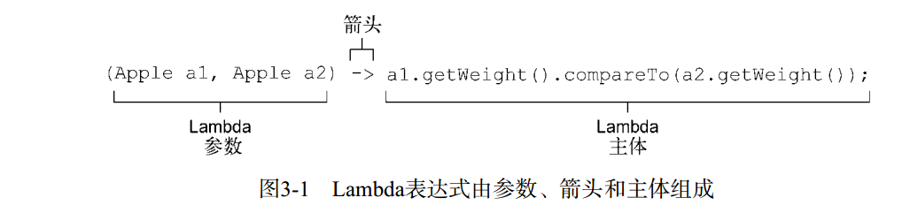

# Java8

## 1.一些概念

1. Lamabda--匿名函数、流、默认方法

### 例子：筛选苹果--》方法引用

```java
//苹果集合
List<Apple> inventory = Arrays.asList(new Apple(80,"green"),
                                              new Apple(155, "green"),
                                              new Apple(120, "red"));


//改进，使用谓词
public static List<Apple> filterApples(List<Apple> inventory, Predicate<Apple> p){
        List<Apple> result = new ArrayList<>();
        for(Apple apple : inventory){
            if(p.test(apple)){
                result.add(apple);
            }
        }
        return result;
}
public static boolean isGreenApple(Apple apple) {
        return "green".equals(apple.getColor()); 
    }

public static boolean isHeavyApple(Apple apple) {
        return apple.getWeight() > 150;
    }
//方法引用

 // [Apple{color='green', weight=80}, Apple{color='green', weight=155}]
List<Apple> greenApples = filterApples(inventory, FilteringApples::isGreenApple);
```

### Lambda--匿名函数

>为了简化isGreenApple、isHeavyApple等这些只会使用几次的方法，Java8引入了匿名函数Lambda

```java
 List<Apple> greenApples2 = filterApples(inventory, (Apple a) -> "green".equals(a.getColor()));
```

### 流 Stream

### 默认方法

## 2.通过行为参数化传递代码

```java
//筛选出绿色的苹果
public static List<Apple> filterGreenApples(List<Apple> inventory){
        List<Apple> result = new ArrayList<>();
        for (Apple apple: inventory){
            if ("green".equals(apple.getColor())) {
                result.add(apple);
            }
        }
        return result;
}
//筛选出红色的苹果
...

//筛选出重量大于150克的苹果
public static List<Apple> filterApplesByWeight(List<Apple> inventory, int weight){
    List<Apple> result = new ArrayList<>();
        for(Apple apple: inventory){
            if(apple.getWeight() > weight){
                result.add(apple);
            }
        }
        return result;
}

//更多需求变更：
....
```

>对需求抽象：需要根据Apple的某些属性来返回一个boolean值，即谓词(一个返回boolean值的函数)

 定义接口对选择标准建模

```java
interface ApplePredicate{
    public boolean test(Apple a);
}
//多个实现
static class AppleWeightPredicate implements ApplePredicate{
    public boolean test(Apple apple){
        return apple.getWeight() > 150; 
    }
}
static class AppleColorPredicate implements ApplePredicate{
    public boolean test(Apple apple){
        return "green".equals(apple.getColor());
    }
}

//使用 ApplePredicate 改进代码

public static List<Apple> filter(List<Apple> inventory, ApplePredicate p){
    List<Apple> result = new ArrayList<>();
    for(Apple apple : inventory){
        if(p.test(apple)){
            result.add(apple);
        }
    }
    return result;
}
//多种行为一个参数
```

缺点：繁琐，声明了很多只需要实例化一次的类

再次改进：使用匿名类

```java
List<Apple> redApples2 = filter(inventory, new ApplePredicate() {
    public boolean test(Apple a){
        return a.getColor().equals("red");
    }
});
```

还是不够直观，继续改进，使用Lambda表达式

```java
 List<Apple> greenApples2 = filterApples(inventory, (Apple a) -> "green".equals(a.getColor()));
```

## Lambda 表达式

>可把Lambda表达式理解为可传递的匿名函数的一种方式。
>没有名称，有参数列表、函数主体、返回类型，可能还有一个可以抛出的异常列表。



```java
//Java8中有效的Lambda表达式：
(String s) -> s.length();
//Lambda没有return语句，因为已经隐含了return
(Apple a) -> a.getWeight() > 150
() -> 42
...
//哪些是正确的Lambda表达式？
//1.
（） -> {}
//2.
() -> "Java*"
//3.
() -> {return "Java8"}
//4.
(Integer i) -> return "Alan" + i;
//5.
(String s) -> {"返回Java8"}
```
### 在哪里以及如何使用Lambda

>**函数式接口**
就是只定义一个抽象方法的接口。

- Comparator<T>
- Runnable
- Callable
...
  
接口还可以有默认方法，但不管有多少默认方法，只要接口中只有一个抽象方法，它就是一个函数式接口。想想扩展接口的情况？

Lambda表达式允许直接以内联的形式为函数式接口的抽象方法提供实现，并把整个表达式作为函数式接口的实例。

```java

Runnable run = () -> System.out.pringln("hello Lambda");
```

#### 函数描述符

函数式接口的抽象方法的签名基本上就是Lambda表达式的签名。将这种抽象方法叫做”函数描述符“。

#### Java8 中定义的函数式接口

在java.util.function包中

- Predicate< T>

- Consumer< T>

- Function

泛型函数式接口，由于泛型只能绑定到引用类型，所以在组合使用基本类型和泛型时，会引发装箱和拆箱机制，这在性能方面是有些代价的，为了避免装箱、拆箱，Java8引入了专门针对基本类型的一些接口：

- IntPredicate

- DoublePredicate

- IntConsumer

等等

**Java8中常用的函数式接口**

函数式接口 | 函数描述符 | 原始类型特化
------------ | ------------- | -------------
Predicate\<T> | T->boolean | IntPredicate,LongPredicate等
Consumer\<T> | T->void | a
Function\<T,R>|T->R|b
