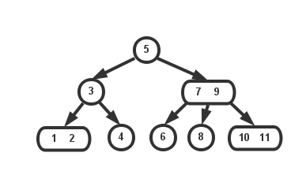
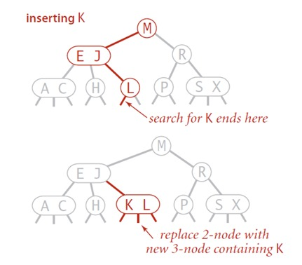
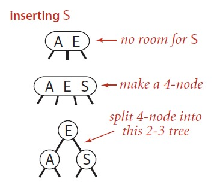
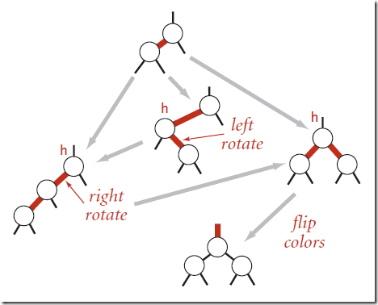
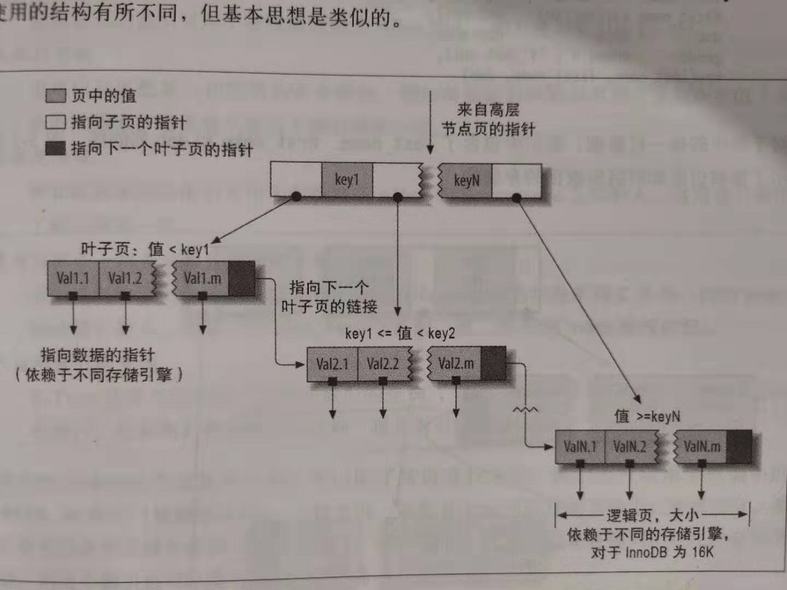
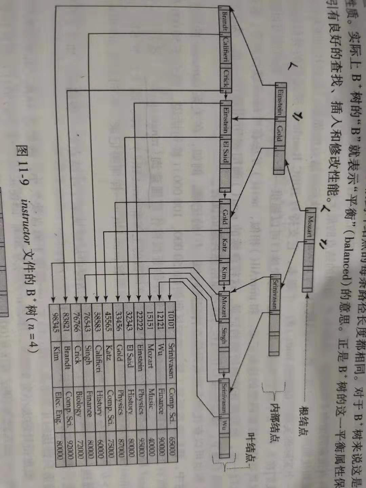

# 树

## 二叉树

**定义：**每个节点最多只有2个分支的树结构，即左子树、右子树，二叉树的第i层至多拥有2^(i-1)个节点；深度为k的二叉树至多总共有2^k-1个节点(定义根节点所在深度k0 =0);

1. 满二叉树：拥有全部节点的二叉树
2. 完全二叉树：从根节点到最后一个节点都和相同深度的满二叉树一一对应。


对任何一颗非空的二叉树，若其叶子节点数为n0,分支度为2的节点数n2, n0=n2+1;


```java
 static void heapSort(int[] a) {
        int n = a.length;
        //首先要构建堆
        for (int i = n / 2 - 1; i >= 0; i--) {
            perDown(a, i, n);
        }
//        for (int j=0;j<n;j++){
//            System.out.println(a[j]);
//        }
        for (int i = n - 1; i > 0; i--) {
            swapMax(a, 0, i);
            perDown(a, 0, i);
        }
    }

    static void swapMax(int[] a, int max, int pos) {
        int m = a[max];
        a[max] = a[pos];
        a[pos] = m;
    }

    static void perDown(int[] a, int i, int n) {
        int child;
        int temp;
        for (temp = a[i]; leftChild(i) < n; i = child) {
            child = leftChild(i);
            if (child != n - 1 && a[child] < a[child + 1]) {
                child += 1;
            }

            if (temp < a[child]) {
                a[i] = a[child];
            } else {
                break;
            }
        }
        a[i] = temp;
    }

    static int leftChild(int i) {
        return 2 * i + 1;
    }

```

## 二叉查找树

是指一颗空树或者具有下列性质的二叉树：
- 若任意节点的左子树非空，则左子树上所有节点的值均小于它的根节点的值
- 若任意节点的右子树非空，则右子树上所有节点的值均大于它的根节点的值
- 任意节点的左、右子树也分别为二叉查找树
- 没有键值相等的节点

```java
public class BST<K extends Comparable<K>, V> {

    private class Node {
        private K k;
        private V v;
        private Node left, right;
        private int N;

        public Node(K k, V v, int n) {
            this.k = k;
            this.v = v;
            this.N = n;
        }
    }

    private Node root;

    public int size() {
        return size(root);
    }

    private int size(Node x) {
        if (null == x) {
            return 0;
        } else {
            return x.N;
        }
    }


    public V get(K k) {
        return get(root, k);
    }

    //搜索数据
    private V get(Node x, K k) {
        if (null == x) {
            return null;
        }
        int cmp = k.compareTo(x.k);
        if (cmp < 0) {
            return get(x.left, k);
        } else if (cmp > 0) {
            return get(x.right, k);
        } else {
            return x.v;
        }

    }

    public void put(K k, V v) {

    }

    //插入数据
    private Node put(Node x, K k, V v) {
        if (x == null) {
            return new Node(k, v, 1);
        }
        int cmp = k.compareTo(x.k);
        if (cmp < 0) {
            x.left = put(x.left, k, v);
        } else if (cmp > 0) {
            x.right = put(x.right, k, v);
        } else {
            x.v = v;
        }
        x.N = size(x.left) + size(x.right) + 1;
        return x;
    }

    //范围查找
    public Iterable<K> keys() {

    }

    public Iterable<K> keys(K lo, K hi) {
        Queue<K> queue = new LinkedList<K>();
        keys(root, queue, lo, hi);
        return queue;
    }

    private void keys(Node x, Queue<K> queue, K lo, K hi) {
        if (x == null) {
            return;
        }
        int cmplo = lo.compareTo(x.k);
        int cmphi = hi.compareTo(x.k);
        if (cmplo < 0) keys(x.left, queue, lo, hi);
        if (cmplo <= 0 && cmphi >= 0) queue.add(x.k);
        if (cmphi > 0) {
            keys(x.right, queue, lo, hi);
        }
    }
}

```


## 平衡查找树

### 2-3树

为了保证查找树的平衡性，我们需要一些灵活性，这里允许树中的一个节点保存多个键。一颗标准的二叉查找树中的节点称为2-节点(含有1个键和2条链接)，现在引入3-节点(含有2个键和3条链接);


一颗完美平衡的2-3查找树中的所有空链到根节点的距离都是相同的



#### 向2-节点中插入新键

首先进行一次未命中的查找，然后把新节点挂在树的底部，但这样就导致树无法完美平衡；使用2-3树就是因为在插入后能继续保持平衡，如果未命中查找结束于一个2节点，直接把这个2节点变为3节点就行。



#### 向3-节点中插入新键

首先将其变为一个4-节点，即含有3个键和4条链接：



##### 向一个父节点是2-节点的3-节点插入新建

未命中的查找结束于一个3-节点，其父节点是一个2-节点。将新建插入到3-节点，变成一个4-节点，将4-节点分解，其中间键上升到父节点2-节点中，此时父节点变成3-节点，插入结束


##### 向一个父节点是3-节点的3-节点插入新建


未命中的查找结束于一个3-节点，其父节点是一个3-节点。将新建插入到3-节点，变成一个4-节点，将4-节点分解，其中间键上升到父节点3-节点中，此时父节点变成4-节点，继续分解4-节点，直至树中不存在4-节点，插入结束


和标准的二叉查找树由上向下生长不同，2-3树的生长是由下向上的。


### 红黑树

对称二叉B树，

从2-3树中的3-节点来理解红黑树，通过添加额外的信息来由3-节点转换为红黑树。


给定任意的2-3树，都可以将其转换为对应的红黑树：


- 红链接均为左链接
- 没有任何一个节点同时和2条红链接相连


从父节点链向本节点，则其color为红色，反之为黑色。

旋转：即旋转红链的方向，

左旋：将红链在右边的旋转到左边


右旋：将红链在左边的旋转到右边


颜色翻转：

经过一系列翻转后，可能存在父节点和2条红色子链相连的情况，这时就要翻转颜色


将2个子节点的颜色改为黑色，将父节点的颜色改为红色。

红黑树中红链向上传递



```java

private class Node {
        private Key key;           // key
        private Value val;         // associated data
        private Node left, right;  // links to left and right subtrees
        private boolean color;     // color of parent link
        private int size;          // subtree count

        public Node(Key key, Value val, boolean color, int size) {
            this.key = key;
            this.val = val;
            this.color = color;
            this.size = size;
        }
    }

   public void put(Key key, Value val) {
        if (key == null) throw new IllegalArgumentException("first argument to put() is null");
        if (val == null) {
            delete(key);
            return;
        }

        root = put(root, key, val);
        root.color = BLACK;
        // assert check();
    }

    // insert the key-value pair in the subtree rooted at h
    private Node put(Node h, Key key, Value val) { 
        //和父节点用红链接相连
        if (h == null) return new Node(key, val, RED, 1);

        int cmp = key.compareTo(h.key);
        if      (cmp < 0) h.left  = put(h.left,  key, val); 
        else if (cmp > 0) h.right = put(h.right, key, val); 
        else              h.val   = val;

        // fix-up any right-leaning links
        if (isRed(h.right) && !isRed(h.left))      h = rotateLeft(h);
        if (isRed(h.left)  &&  isRed(h.left.left)) h = rotateRight(h);
        if (isRed(h.left)  &&  isRed(h.right))     flipColors(h);
        h.size = size(h.left) + size(h.right) + 1;

        return h;
    }

```


红黑树生长轨迹：


## B树

> B树是为磁盘或其他直接存取的辅助存储设备而设计的一种平衡搜索树，B树类似于红黑树，但它们在降低磁盘IO操作数方面更好一些，B树适用于读写相对大的数据块的存储系统，例如磁盘。B树减少定位记录时所经历的中间过程，从而加快存取速度，许多数据库系统使用B树或者B树的变种存储信息

B树与红黑树的不同之处在于B树的节点可以有很多子节点，


**用阶定义的B树**

阶数表示了一个节点最多有多少个孩子节点，一般用字母m表示阶数，m=2时就是常见的二叉查找树
- 每个节点最多含有m-1个关键字
- 根节点最少可以只有1个关键字






在B+树上的查询，假设我们要找出搜索码值为V的所有记录？
从根节点作为当前节点出发，首先，检查当前节点，查找最小的i使得搜索码值Ki大于等于V，假设找到了这样的值，如果Ki等于V，那么将当前节点置为有P(i+1)指向的节点；如果Ki大于V，则将当前节点置为有Pi指向的节点；如果没有找到这样的值，则K(m-1)<=V，Pm是节点中最后一个非空指针，将当前节点置为由Pm指向的节点，重复上述过程。

E:\project\git\workspace\img

https://www.cnblogs.com/nullzx/p/8729425.html
https://www.jianshu.com/p/bbd5d5b4d1a3
